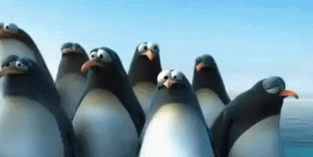
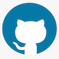

# Andrii Vlasiuk

- I am from Ukraine. I am 30 years old. I am really like nature, fishing and coding.

- Before i used to work in hospitality industry and at the moment i am job seeker.

## My super-skills

 
 
- Fishing
- Reading
- Coding
  
## My favorite staff on this planet

- Life :)
- Nature :seedling:
- Sun :sunny:

## My goals with BeCode

- I want ot improve my coding skills
  
- I would like to find new friends who loves coding same as me.
- In the end of course i hope to be good enough to find a job.

## Fears

- To be not good enough to find a job :scream_cat:
- Do not reach all my goals at BeCode.
  
## Future expectations

- I am really curious about future team work and the projects.

## Team work

- I am team player and i think **Team work make dream work** so will expect from my teammates:
- To be open fro conversation
- Ask questions if you stuck at some point
- Share your minds about the projects
- Always be part of the team

## How you can find me

